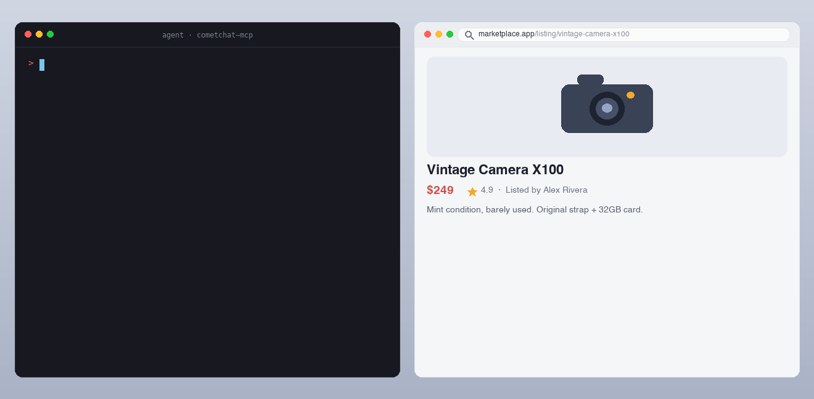

<div align="center">

# CometChat MCP Server

**Add real-time chat, voice, video, and moderation to your app through your AI coding agent.**

[](https://github.com/cometchat/docs-mcp/actions/workflows/ci.yml)
[](https://github.com/cometchat/docs-mcp/releases)
[](https://registry.modelcontextprotocol.io/v0/servers?search=io.github.cometchat/docs-mcp&version=latest)
[](https://smithery.ai/servers/cometchat/docs-mcp)
[](https://glama.ai/mcp/servers/cometchat/docs-mcp)
[](https://www.claudepluginhub.com/plugins/cometchat-cometchat?ref=badge)
[](LICENSE)
[](https://modelcontextprotocol.io)
[](https://mcp.cometchat.com/health)

[**Docs**](https://www.cometchat.com/docs/mcp-server) • [**CometChat**](https://www.cometchat.com) • [**Get an account (free, 100 MAU)**](https://app.cometchat.com)

</div>

---

CometChat's first-party MCP server. Connect Claude, Cursor, Windsurf, VS Code Copilot, Codex, or any other Model Context Protocol–compatible agent and integrate CometChat into your app from natural-language prompts.

Ask the agent: *"add a chat tab where users can DM each other"* — it reads CometChat's documentation, picks the right components for your stack, and writes the integration code.

**Read-only. No account, no API key, no authentication required.**

---

## Demo



*An AI agent reading CometChat's docs and writing a working chat integration from a single prompt.*

---

## Quick install

| Agent | How to add |
|---|---|
| **Claude.ai / Claude Desktop** | Settings → Connectors → Add custom connector → URL: `https://mcp.cometchat.com/mcp` |
| **Cursor** | `Cmd+Shift+P` → Open MCP settings → Add custom MCP → paste config below |
| **Windsurf** | Plugins (hammer icon) → Manage plugins → View raw config → paste config below |
| **VS Code (Copilot Agent)** | `Cmd+Shift+P` → MCP: Add MCP Server → URL: `https://mcp.cometchat.com/mcp`, Transport: SSE |
| **Claude Code (CLI)** | `claude mcp add --transport http cometchat https://mcp.cometchat.com/mcp` |
| **Smithery** | `npx -y smithery mcp add cometchat/docs-mcp` |
| **Codex CLI** | `codex plugin marketplace add cometchat/docs-mcp` |

### Config snippet (Cursor / Windsurf / generic MCP clients)

```json
{
  "mcpServers": {
    "cometchat": {
      "url": "https://mcp.cometchat.com/mcp"
    }
  }
}
```

---

## Usage

After connecting, prompt your agent with any of these:

- *"How do I install the React UI Kit in my Vite project?"*
- *"Walk me through multi-tenant chat for a Next.js SaaS where workspaces are isolated."*
- *"Show me how to add presence indicators and typing dots to my iOS conversation list."*
- *"Set up content moderation so banned words are blocked before delivery."*
- *"Build a no-code chat widget for my Webflow site."*
- *"What's the rate limit for sending messages, and what error code do I get when I hit it?"*

The agent reads CometChat's documentation, pulls the relevant implementation bundle, and writes the integration code into your project.

---

## Tools

| Name | Purpose |
|---|---|
| `search_cometchat_docs` | Search across SDK guides, UI Kit references, REST API documentation, and OpenAPI specs. Returns ranked snippets with titles + direct links. Optional `version` filter. |
| `fetch_cometchat_doc_page` | Fetch the full content of any documentation page as markdown by URL or relative path. |
| `get_cometchat_implementation_bundle` | Return a curated implementation bundle for a named scenario — prerequisites, install commands, configuration, working code. |

All three carry `readOnlyHint: true` and a `title` annotation. Names are ≤ 64 characters. Descriptions describe contracts only — no behavioral instructions to the agent, no cross-tool routing, no marketing language.

## Resources

| URI | Purpose |
|---|---|
| `cometchat://skills/overview` | Agent orientation skill — Product summary, decision guidance, workflow, common gotchas, verification checklist |
| `cometchat://bundles/react-uikit-quickstart` | React UI Kit install + init + login + chat surface |
| `cometchat://bundles/react-native-uikit-quickstart` | React Native UI Kit with navigation and chat screen |
| `cometchat://bundles/flutter-uikit-quickstart` | Flutter UI Kit install + init + basic chat |
| `cometchat://bundles/ios-uikit-quickstart` | iOS UI Kit (SwiftUI) install + chat view |
| `cometchat://bundles/android-uikit-quickstart` | Android UI Kit (Jetpack Compose) install + chat screen |
| `cometchat://bundles/js-sdk-messaging-basics` | Vanilla JS SDK — send/receive text and media messages |
| `cometchat://bundles/widget-embed` | No-code widget embed for HTML, Squarespace, Webflow, Wix, WordPress, Shopify |
| `cometchat://bundles/moderation-setup` | AI moderation rules, image moderation, webhooks |
| `cometchat://bundles/multi-tenant-chat` | Multi-tenant SaaS chat — tenant isolation, server-issued Auth Tokens |
| `cometchat://bundles/presence-and-typing` | Online presence, typing indicators, read receipts |

---

## How it works

1. **You prompt your agent** in natural language.
2. **The agent reads the orientation skill** (`cometchat://skills/overview`) to understand which tool/bundle fits your request.
3. **For top scenarios**, the agent pulls a curated implementation bundle — ready-to-run code with prerequisites, install commands, configuration, and working examples.
4. **For long-tail questions**, the agent searches CometChat's docs and reads specific reference pages.
5. **The agent writes the code** into your project, using the bundle as the source of truth and your project structure as the constraint.

---

## CometChat in 30 seconds

CometChat is a real-time communications platform for adding chat, voice, and video calling to web and mobile apps. Used in production across SaaS, marketplaces, gaming, healthcare, education, and creator platforms.

- **Free tier:** first 100 monthly active users, no credit card required.
- **SDKs:** JavaScript, React Native, iOS, Android, Flutter.
- **UI Kits:** React, React Native, iOS, Android, Flutter, Angular, Vue.
- **No-code:** chat widget for any HTML site.
- **Sign up:** [`app.cometchat.com`](https://app.cometchat.com) — you'll need an App ID, Auth Key, and Region to build with the code the agent writes.

---

## Server identity

| Field | Value |
|---|---|
| Display name | CometChat Docs |
| Version | 0.1.5 |
| Protocol | MCP `2025-06-18` |
| Transport | Streamable HTTP (with SSE) |
| Authentication | None (public docs only) |
| Capabilities | `tools`, `resources` |
| Health endpoint | `GET https://mcp.cometchat.com/health` |

---

## Architecture

```
Your agent (Claude / Cursor / Windsurf / …)
        ↓ MCP over Streamable HTTP
        ↓
  mcp.cometchat.com/mcp  (this server)
        ↓
  ├── search_cometchat_docs     → SQLite FTS5 index of cometchat/docs
  ├── fetch_cometchat_doc_page  → cometchat.com/docs/*.md (first-party)
  └── get_cometchat_implementation_bundle → bundled markdown recipes
```

- Stateless server, single universal endpoint, no user-specific state.
- Search index rebuilds from `github.com/cometchat/docs` on every push to that repo's `main` branch.
- Implementation bundles carry a `last_verified` date and are re-checked against live SDK versions quarterly.

---

## Local development

```bash
# Clone the docs repo (used to build the search index)
git clone --depth 1 https://github.com/cometchat/docs.git ../cometchat-docs-repo

# Install + build the FTS index + run the server
npm install
DOCS_REPO=../cometchat-docs-repo npm run build:index
npm run dev

# Run the test suite (36 tests across validation, truncation, bundles, tools, resources, fetch)
npm test
```

The server listens on `http://0.0.0.0:3000` by default. Health probe at `GET /health`, MCP endpoint at `POST /mcp`.

### Inspect with the MCP Inspector

```bash
npx @modelcontextprotocol/inspector
# add server: http://localhost:3000/mcp
```

You should see all 3 tools with `readOnlyHint: true` and all 11 resources.

### Repo layout

```
docs-mcp/
├── src/
│   ├── server.ts                  # MCP server entry, transport, tool dispatch
│   ├── tools/{search,fetch,bundle}.ts
│   ├── search/sqlite.ts           # SQLite FTS5 client
│   ├── bundles/loader.ts          # markdown bundle store
│   ├── resources/registry.ts      # skill + bundle resources
│   └── lib/{errors,truncate,validation,logger}.ts
├── scripts/build-index.ts         # builds SQLite FTS5 index from cometchat/docs
├── bundles/                       # 10 curated implementation bundles
├── skills/overview.md             # agent orientation skill
├── tests/                         # vitest suite
├── .claude-plugin/
│   ├── plugin.json                # Claude Code plugin manifest
│   └── marketplace.json           # Claude Code marketplace manifest
├── .codex-plugin/plugin.json      # Codex plugin manifest
├── .cursor-plugin/plugin.json     # Cursor Marketplace manifest
├── .mcp.json                      # MCP config (Claude Code auto-discovery)
├── mcp.json                       # Open Plugins standard manifest
└── assets/logo.svg                # CometChat logo
```

---

## Configuration

| Env var | Default | Notes |
|---|---|---|
| `PORT` | `3000` | HTTP port |
| `HOST` | `0.0.0.0` | Bind host |
| `DOCS_BASE_URL` | `https://www.cometchat.com/docs` | Used for URLs in responses + the `.md` fetch fallback |
| `INDEX_PATH` | `./data/index.sqlite` | SQLite FTS5 index location. Server still boots if missing; search returns `backend_unavailable` and `/health` is `503`. |
| `BUNDLES_DIR` | `./bundles` | Markdown bundles directory |
| `SKILLS_DIR` | `./skills` | Orientation skill (`overview.md`) directory |
| `FETCH_TIMEOUT_MS` | `5000` | Per-fetch HTTP timeout |
| `LOG_LEVEL` | `info` | `debug` / `info` / `warn` / `error` |
| `NODE_ENV` | `development` | `production` makes bundle loading strict — a malformed bundle aborts boot instead of being skipped |
| `ALLOWED_HOSTS` | `<HOST>:<PORT>,localhost:<PORT>,127.0.0.1:<PORT>` | Comma-separated `Host` header allowlist for DNS-rebinding protection |
| `ALLOWED_ORIGINS` | _unset_ | Comma-separated CORS origin allowlist |
| `DNS_REBINDING_PROTECTION` | `true` | Set `false` only if an upstream already validates `Host` |
| `RATE_LIMIT_ENABLED` | `true` | Set `false` to disable per-IP rate limiting on `/mcp` |
| `RATE_LIMIT_MAX` | `120` | Max requests per window per IP |
| `RATE_LIMIT_WINDOW_MS` | `60000` | Rate-limit window in ms |

---

## Deployment

See [`DEPLOY.md`](./DEPLOY.md) for container build, environment, and platform notes.

---

## Marketplaces

The same server URL is listed across multiple agent marketplaces:

| Marketplace | Listing |
|---|---|
| Smithery | [`smithery.ai/servers/cometchat/docs-mcp`](https://smithery.ai/servers/cometchat/docs-mcp) |
| Glama | [`glama.ai/mcp/servers/cometchat/docs-mcp`](https://glama.ai/mcp/servers/cometchat/docs-mcp) |
| Cursor Marketplace | `cursor.com/marketplace` |
| Cursor Directory | `cursor.directory` |
| Anthropic Connector Directory | `claude.com/connectors` |
| Codex Marketplace | `codex-marketplace.com` |

---

## Support

- **Issues / feedback:** open an issue in this repo.
- **CometChat support:** [`support@cometchat.com`](mailto:support@cometchat.com).
- **Live MCP status:** `curl https://mcp.cometchat.com/health` returns `{"status":"ok"}` when healthy.

---

## Contributing

PRs welcome — especially:

- **New implementation bundles** for under-served scenarios (drop a markdown file in `bundles/` with the required frontmatter).
- **Bundle refreshes** when SDK versions change (`last_verified` date in the bundle's frontmatter triggers a CI warning if older than 6 months).
- **Tool improvements** behind the existing read-only contract.

Out of scope today:
- Tools that write to a customer's CometChat app (separate authenticated connector, on the roadmap).
- Mixed read/write tools (Anthropic auto-rejection rule).

---

## Privacy

The CometChat MCP server is **read-only** and requires no account, API key, or authentication. It serves only CometChat's public documentation and does not request, store, or transmit your code, prompts, or personal data. Standard request metadata (such as IP address) may be processed transiently for rate limiting and abuse prevention.

For full details, see CometChat's privacy policy: [`cometchat.com/legal-privacy-policy`](https://www.cometchat.com/legal-privacy-policy).

---

## License

Apache-2.0. See [LICENSE](LICENSE).
